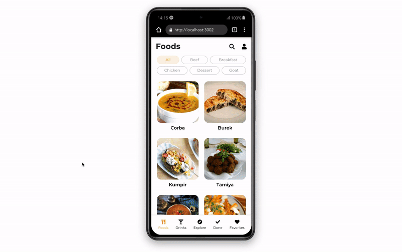

## Yummy!

## About:

A full-featured front-end application with focus on mobile design.

The goal was to create a recipes app, where users could simulate a login (the application has no backend, however) and search for meals or cocktails recipes, with filters for ingredients, name, nationality, etc. The user can also mark a recipe as done and save them as favorites, so they can go back at any time!

The app has a dark-mode available, that gets stored as an user preference to localStorage.

It was made to work well on mobile, so a desktop view is not advised at the moment.

The app was developed with <b>React.js</b> functional components, using native and custom hooks, and with <b>Redux</b> for state managing.

You can <a href="https://luacomacento.github.io/yummy-app/" target="_blank">click here</a> to check the current state of the application.

## Tools:
<ul>
  <li>React.js</li>
  <li>Redux</li>
  <li>CSS3</li>
  <li>Jest</li>
  <li>React Testing Library</li>
</ul>

## Made by:
This app was made as a group project, alongside my dear friends Hanna, Joarez, Matheus and Victoria.

## In works:
As of now, I am working on making the page fully responsive.
